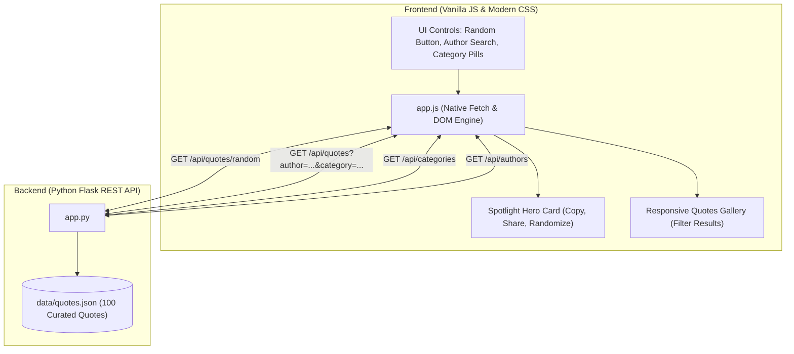

# Maria Famous Quotes (Wisdom Vault)

[](https://www.python.org/)
[](https://flask.palletsprojects.com/)
[](https://developer.mozilla.org/en-US/docs/Web/JavaScript)
[](https://developer.mozilla.org/en-US/docs/Web/HTML)
[](https://developer.mozilla.org/en-US/docs/Web/CSS)
[]()
[](LICENSE)

An elegant, modern single-page web application that showcases a curated collection of **100 well-known, timeless quotes** from history's greatest philosophers, scientists, authors, and leaders.

Built with **Python Flask** on the backend and **100% Plain Vanilla JavaScript, HTML5, and CSS3** on the frontend — **no external JavaScript libraries or heavy UI frameworks required**.

---

## ✨ Features

- 🎲 **Random Quote Spotlight**:
  - Highlights an inspiring quote on initial load.
  - Instant generation of new random quotes with smooth visual transitions.
- 🔍 **Real-Time Author & Keyword Search**:
  - Live, debounced search as you type (e.g., search `Einstein`, `Twain`, `Socrates`).
  - Clear button (×) for one-click reset.
- 🏷️ **Dynamic Category Filter Pills**:
  - Live count badges for each category: *Philosophy, Science, Inspiration, Literature, Leadership, Wisdom, Humor, Life, Art*.
  - Toggle between all quotes or specific genres effortlessly.
- 📋 **One-Click Copy & Share**:
  - Copy any quote to the clipboard formatted as `"Quote" — Author` with an animated toast notification.
  - Native Twitter / X share intent button.
- 🗂️ **Interactive Quotes Gallery**:
  - Responsive multi-column grid displaying all matching quotes.
  - Clicking any quote card spotlights it at the top and smoothly scrolls into view.
- ⚡ **Zero JS Dependencies**:
  - Pure native ES6+ `fetch`, DOM APIs, and CSS custom properties for blazing fast performance.
- 🛡️ **Tested & Reliable**:
  - Automated test suite (15 tests) ensuring 100% data integrity, schema validation, and API reliability.

---

## 🏛️ Architecture



---

## 📁 Project Directory Layout

```
Maria-famous-quotes/
├── .gitignore              # Ignores __pycache__, virtualenvs, logs, IDE configs
├── README.md               # Project documentation
├── requirements.txt        # Flask & test dependencies
├── app.py                  # Flask web server & REST API
├── data/
│   └── quotes.json         # Database of 100 curated quotes with authors & categories
├── static/
│   ├── css/
│   │   └── style.css       # Responsive styling with CSS variables & flex/grid
│   └── js/
│       └── app.js          # Plain vanilla JS (DOM, fetch, clipboard, debounce)
├── templates/
│   └── index.html          # Semantic HTML5 layout
└── tests/
    └── test_app.py         # 15 automated unit tests
```

---

## 🚀 Quick Start

### Prerequisites
- [Python 3.8+](https://www.python.org/downloads/)
- [Git](https://git-scm.com/)

### 1. Clone the Repository
```bash
git clone https://github.com/belmokhtarmaria9-tech/Maria-famous-quotes.git
cd Maria-famous-quotes
```

### 2. Set Up a Virtual Environment (Optional but Recommended)
```bash
# Windows
python -m venv .venv
.venv\Scripts\activate

# macOS / Linux
python3 -m venv .venv
source .venv/bin/activate
```

### 3. Install Dependencies
```bash
pip install -r requirements.txt
```

### 4. Run the Application
```bash
python app.py
```

Open your browser and navigate to:
👉 **[http://127.0.0.1:5000](http://127.0.0.1:5000)**

---

## 📡 REST API Reference

The Flask application exposes a clean JSON REST API:

### 1. Get Random Quote
```http
GET /api/quotes/random
```
**Optional Query Parameters**:
- `category` (string): Filter random selection by category (e.g. `philosophy`)
- `author` (string): Filter random selection by author name (e.g. `einstein`)

**Sample Response**:
```json
{
  "id": 2,
  "quote": "In the middle of difficulty lies opportunity.",
  "author": "Albert Einstein",
  "category": "Inspiration"
}
```

---

### 2. Search & Filter Quotes
```http
GET /api/quotes?author=einstein&category=science
```
**Optional Query Parameters**:
- `author` (string): Substring search in author names
- `category` (string): Exact category match
- `q` (string): Full-text search across quote text, author, and category

**Sample Response**:
```json
{
  "total": 4,
  "quotes": [
    {
      "id": 20,
      "quote": "Imagination is more important than knowledge...",
      "author": "Albert Einstein",
      "category": "Science"
    }
  ]
}
```

---

### 3. Get Categories with Counts
```http
GET /api/categories
```
**Sample Response**:
```json
{
  "total": 100,
  "categories": [
    { "name": "Art", "count": 4 },
    { "name": "Humor", "count": 6 },
    { "name": "Inspiration", "count": 17 },
    { "name": "Leadership", "count": 13 },
    { "name": "Life", "count": 8 },
    { "name": "Literature", "count": 9 },
    { "name": "Philosophy", "count": 16 },
    { "name": "Science", "count": 11 },
    { "name": "Wisdom", "count": 16 }
  ]
}
```

---

### 4. Get List of Authors
```http
GET /api/authors
```
**Sample Response**:
```json
{
  "total": 46,
  "authors": [
    "Abraham Lincoln",
    "Albert Einstein",
    "Anaïs Nin",
    "Aristotle",
    "Babe Ruth",
    "Benjamin Franklin",
    "Buddha",
    "Confucius",
    "..."
  ]
}
```

---

## 🧪 Running Automated Tests

The application comes with 15 automated test cases using Python's built-in `unittest` framework:

```bash
python -m unittest discover -s tests -p "test_*.py" -v
```

### What is verified:
- ✅ **Dataset Integrity**: Verifies 100 quotes exist with unique IDs and non-empty fields.
- ✅ **Schema Validation**: Tests type definitions for all quote fields.
- ✅ **API Filtering**: Verifies category, author, and combined filter logic.
- ✅ **Edge Cases**: 404 handling on unknown categories and empty search results.
- ✅ **Static Asset Serving**: Validates proper serving of HTML, CSS, and JS.

---

## 👤 Author

**Maria Belmokhtar**
- GitHub: [@belmokhtarmaria9-tech](https://github.com/belmokhtarmaria9-tech)
- Repository: [Maria-famous-quotes](https://github.com/belmokhtarmaria9-tech/Maria-famous-quotes)

---

## 📄 License

This project is licensed under the [MIT License](LICENSE).
